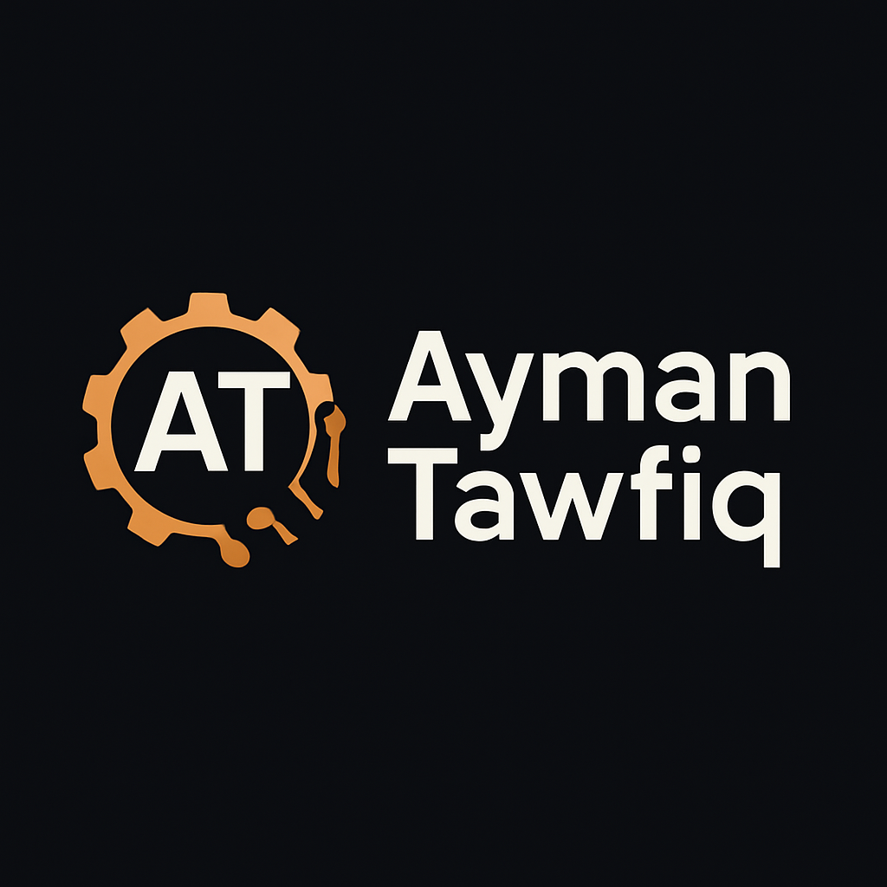

<!-- ملف README احترافي لصفحة GitHub الخاصة بك -->

<!-- صورة غلاف -->

  

<h1 align="center">👨‍💻 Ayman Tawfaq</h1>

  <b>مبرمج محترف ومطور متعدد المنصات</b> 
  Flutter • Laravel • C# • Arduino • Python • API Integration • Web Apps

  
  
  
  
  
  

---

## 💡 من أنا؟

مرحبًا 👋  
أنا **أيمن توفيق**، مبرمج شغوف بتطوير التطبيقات والمشاريع الذكية. أمتلك خبرة متعددة في مجالات مختلفة من تطوير البرمجيات، بدءًا من تطبيقات الهواتف إلى التحكم في الأجهزة باستخدام Arduino.

### 🧰 المهارات:

- ✅ تطوير تطبيقات الهواتف باستخدام **Flutter**
- ✅ تصميم واجهات وإدارة قواعد البيانات بـ **Laravel + MySQL**
- ✅ بناء تطبيقات سطح المكتب بـ **C# / WPF**
- ✅ برمجة المتحكمات الدقيقة بـ **Arduino / ESP**
- ✅ تطوير مساعدات صوتية وواجهات ذكية بـ **Python + PyQt5**
- ✅ ربط **واجهات التطبيقات بالـ APIs** بشكل احترافي

---

## 🚀 مشاريع أعمل عليها

- 🎤 **Ayman Voice Assistant** – مساعد صوتي باللغة العربية (Python + PyQt5)
- 📱 تطبيقات Flutter تعمل على Android و iOS
- 🌐 لوحات تحكم احترافية بـ Laravel
- 🤖 مشاريع Arduino ذكية: روبوتات، أنظمة استشعار، ذكاء صناعي مدمج

---

## 🌍 تواصل معي

  
  
  

---

## ✨ أهدافي القادمة

- تطوير مساعد صوتي عربي يعتمد على الذكاء الاصطناعي الحقيقي (NLP)
- نشر مكتبات مفتوحة المصدر تفيد المبرمجين العرب
- تصميم منصة تعليمية للمبتدئين في Arduino وFlutter

---

## 📈 إحصائيات GitHub

  
  

---

## 🖼️ شعار شخصي

  

---

## ⭐ أدعم أعمالي

إذا أعجبتك مشاريعي، لا تنسَ:

- 🌟 إعطاء نجمة لمستودعاتي
- 👁️ متابعتي على GitHub
- 💬 التواصل معي لأي تعاون برمجي

> معًا نرتقي بالمحتوى العربي التقني 💪

